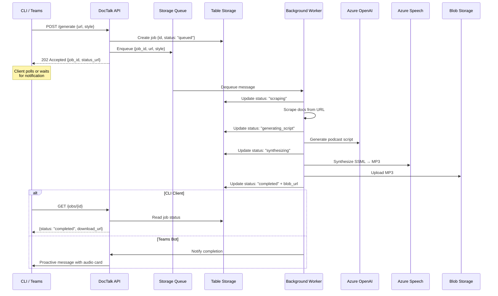
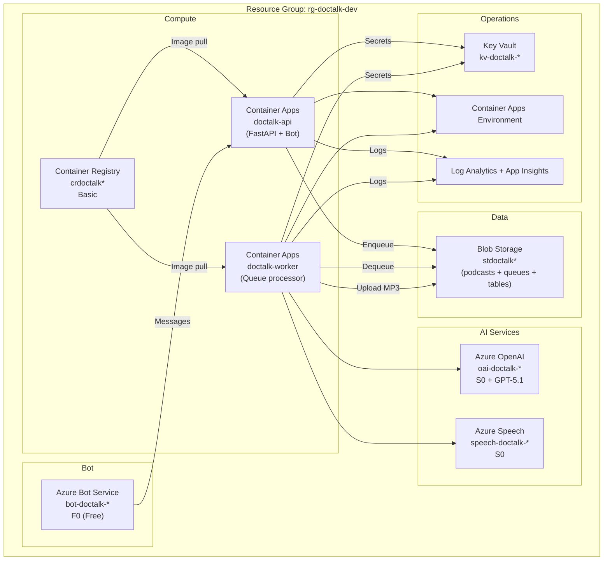
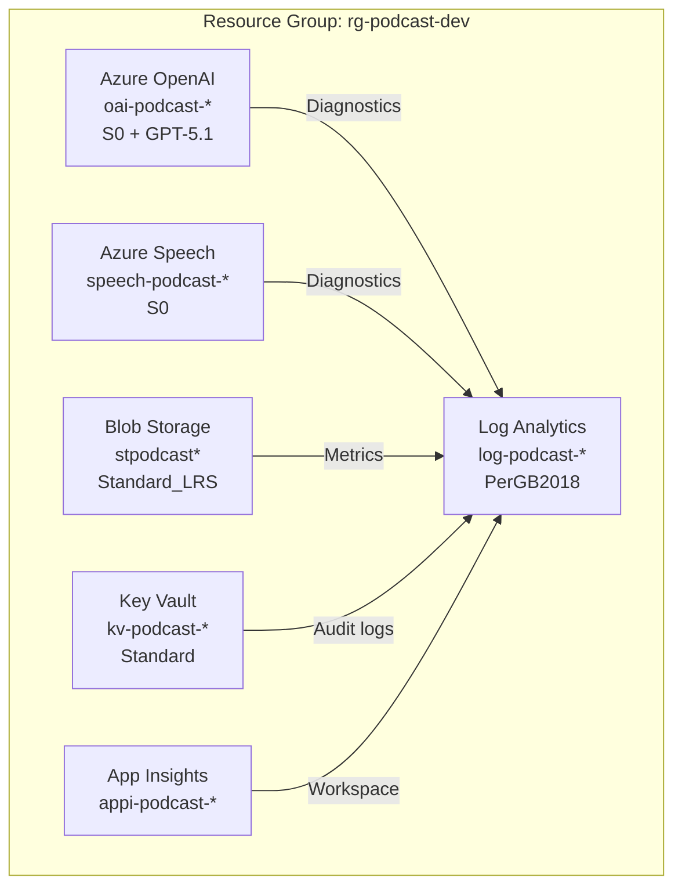

# Architecture — DocTalk

> Last updated: 2026-04-22 | Status: Phase 1 Deployed (CLI), Phase 2 Designed (API + Teams)

---

## 1. Vision Statement

Enable developers and cloud practitioners to consume Azure documentation as podcast-style audio, making it easy to learn on the go — during commutes, workouts, or breaks. Accessible from **CLI**, **Microsoft Teams**, and future channels via a shared API backend.

---

## 2. Architecture Evolution

| Phase | Channels | Compute | Processing |
|-------|----------|---------|------------|
| **Phase 1 (Current)** | CLI | Local Python | Synchronous |
| **Phase 2 (Next)** | CLI + Teams Bot | Azure Container Apps | Async with queue |
| **Phase 3 (Future)** | + Mobile / Web | ACA + CDN | Async + caching |

---

## 3. Phase 2 Target Architecture

```mermaid
flowchart TB
    subgraph "Clients"
        CLI["🖥️ CLI<br/>(Python)"]
        TEAMS["💬 Teams Bot<br/>(Bot Framework)"]
    end

    subgraph "Azure Container Apps"
        API["🌐 DocTalk API<br/>(FastAPI)"]
        WORKER["⚙️ Worker<br/>(Background processor)"]
    end

    subgraph "Messaging"
        QUEUE["Azure Storage Queue<br/>(Job queue)"]
    end

    subgraph "AI Services"
        OAI["Azure OpenAI<br/>GPT-5.1"]
        SPE["Azure Speech<br/>Neural TTS"]
    end

    subgraph "Storage & State"
        BLOB["Blob Storage<br/>podcasts container"]
        TABLE["Table Storage<br/>job status tracking"]
    end

    subgraph "Operations"
        KV["Key Vault"]
        LOG["Log Analytics<br/>+ App Insights"]
    end

    CLI -->|POST /generate| API
    TEAMS -->|Bot message| API
    API -->|Enqueue job| QUEUE
    API -->|Create job record| TABLE
    QUEUE -->|Dequeue| WORKER
    WORKER -->|Script gen| OAI
    WORKER -->|TTS synthesis| SPE
    WORKER -->|Upload MP3| BLOB
    WORKER -->|Update status| TABLE
    CLI -->|GET /jobs/{id}| API
    TEAMS -.->|Proactive notification| TEAMS
    API -->|Read status| TABLE
    API -->|Generate SAS URL| BLOB
    API & WORKER -.->|Auth| KV
    API & WORKER -.->|Telemetry| LOG
```

---

## 4. Async Processing Flow



---

## 5. API Contract

### `POST /generate`

Request a new podcast generation (async).

```json
{
  "url": "https://learn.microsoft.com/azure/container-apps/overview",
  "style": "conversation",
  "notify_teams": false
}
```

Response (`202 Accepted`):

```json
{
  "job_id": "a1b2c3d4-e5f6-7890-abcd-ef1234567890",
  "status": "queued",
  "status_url": "/jobs/a1b2c3d4-e5f6-7890-abcd-ef1234567890",
  "estimated_wait_seconds": 90
}
```

### `GET /jobs/{job_id}`

Poll job status.

```json
{
  "job_id": "a1b2c3d4-...",
  "status": "completed",
  "title": "Azure Container Apps Overview",
  "style": "conversation",
  "duration_seconds": 312,
  "download_url": "https://stpodcast*.blob.core.windows.net/podcasts/a1b2c3d4.mp3?sv=...",
  "created_at": "2026-04-22T15:30:00Z",
  "completed_at": "2026-04-22T15:31:32Z"
}
```

### `GET /jobs`

List recent jobs.

```json
{
  "jobs": [ ... ],
  "count": 5
}
```

### Status Lifecycle

```
queued → scraping → generating_script → synthesizing → uploading → completed
                                                                  → failed
```

---

## 6. Component Design (Phase 2)

### 6.1 DocTalk API (`src/api/`)

| Aspect | Detail |
|--------|--------|
| **Framework** | FastAPI (async, auto OpenAPI docs) |
| **Hosting** | Azure Container Apps (serverless, scale to zero) |
| **Auth** | Entra ID (Managed Identity for Azure services) |
| **Endpoints** | `POST /generate`, `GET /jobs/{id}`, `GET /jobs`, `GET /health` |
| **Role** | Accept requests, enqueue jobs, serve status & download URLs |

### 6.2 Background Worker (`src/worker/`)

| Aspect | Detail |
|--------|--------|
| **Trigger** | Azure Storage Queue messages |
| **Hosting** | Azure Container Apps (separate container, auto-scale on queue depth) |
| **Pipeline** | Scrape → Script Gen → TTS → Upload → Update status |
| **Retry** | 3 retries with exponential backoff, dead-letter after failure |
| **Reuses** | Existing `scraper.py`, `script_generator.py`, `speech_synthesizer.py` |

### 6.3 Teams Bot (`src/bot/`)

| Aspect | Detail |
|--------|--------|
| **Framework** | Bot Framework SDK for Python (`botbuilder-core`) |
| **Hosting** | Same Container App as API (mounted at `/api/messages`) |
| **UX** | User pastes URL → bot calls API → sends Adaptive Card with audio player when done |
| **Auth** | Azure Bot Service + Entra app registration |
| **Notifications** | Proactive messaging via conversation reference stored in Table Storage |

### 6.4 CLI (Updated — `src/cli.py`)

| Change | Detail |
|--------|--------|
| **Mode** | Calls DocTalk API instead of running pipeline locally |
| **Submit** | `POST /generate` → get job_id |
| **Poll** | `GET /jobs/{id}` every 5s with spinner |
| **Download** | Fetch MP3 from SAS URL when complete |
| **Fallback** | `--local` flag to run locally as before (no API needed) |

---

## 7. Azure Resource Architecture (Phase 2)



### New Resources (Phase 2 additions)

| Resource | Service | SKU | Purpose | Est. Cost |
|----------|---------|-----|---------|-----------|
| Container Apps Env | `Microsoft.App/managedEnvironments` | Consumption | Serverless container hosting | ~$0 (scale to zero) |
| API Container | `Microsoft.App/containerApps` | Consumption | FastAPI + Bot endpoint | ~$2–5/mo |
| Worker Container | `Microsoft.App/containerApps` | Consumption | Queue-triggered processor | ~$1–3/mo |
| Container Registry | `Microsoft.ContainerRegistry/registries` | Basic | Docker image storage | ~$5/mo |
| Azure Bot Service | `Microsoft.BotService/botServices` | F0 | Teams channel integration | Free |
| **Phase 2 Additional** | | | | **~$8–13/mo** |
| **Total (Phase 1 + 2)** | | | | **~$18–38/mo** |

---

## 8. Teams Bot User Experience

```
┌─────────────────────────────────────────────┐
│ 💬 Microsoft Teams                          │
├─────────────────────────────────────────────┤
│                                             │
│  You:                                       │
│  ┌─────────────────────────────────────┐    │
│  │ https://learn.microsoft.com/azure/  │    │
│  │ container-apps/overview             │    │
│  └─────────────────────────────────────┘    │
│                                             │
│  DocTalk Bot:                               │
│  ┌─────────────────────────────────────┐    │
│  │ 🎙️ Generating podcast...           │    │
│  │ Style: Two-host conversation        │    │
│  │ ⏳ Estimated wait: ~90 seconds      │    │
│  └─────────────────────────────────────┘    │
│                                             │
│  DocTalk Bot:                               │
│  ┌─────────────────────────────────────┐    │
│  │ ✅ Your podcast is ready!           │    │
│  │                                     │    │
│  │ 📄 Azure Container Apps Overview    │    │
│  │ ⏱️ Duration: 5:12                   │    │
│  │ 🎭 Style: Conversation (Alex & Sam)│    │
│  │                                     │    │
│  │ [▶️ Play] [⬇️ Download] [📋 Script]│    │
│  └─────────────────────────────────────┘    │
│                                             │
└─────────────────────────────────────────────┘
```

---

## 9. Phase 1 Component Design (Current — Unchanged)

### 9.1 Scraper (`src/scraper.py`)

| Aspect | Detail |
|--------|--------|
| **Input** | Azure docs URL (learn.microsoft.com) |
| **Output** | `{title, description, content, url}` dict |
| **Method** | HTTP GET + BeautifulSoup HTML parsing |
| **Content extraction** | Targets `<main>` or article divs; strips nav, scripts, footer, feedback sections |
| **Truncation** | Caps at 12,000 chars to fit model context window |
| **Error handling** | HTTP timeout (30s), raise on non-200 status |

### 9.2 Script Generator (`src/script_generator.py`)

| Aspect | Detail |
|--------|--------|
| **Input** | Scraped docs dict + style (`single` / `conversation`) |
| **Output** | Podcast script as plain text |
| **Model** | Azure OpenAI GPT-5.1 (deployment: `gpt-51`) |
| **Auth** | `DefaultAzureCredential` → Bearer token provider |
| **Single narrator** | ~600–1000 words, conversational tone, key takeaways |
| **Two-host** | Alex (expert) + Sam (curious co-host), ~1000–1500 words |
| **Temperature** | 0.7 (balanced creativity/accuracy) |
| **Max tokens** | 4000 completion tokens |

### 9.3 Speech Synthesizer (`src/speech_synthesizer.py`)

| Aspect | Detail |
|--------|--------|
| **Input** | Script text + output file path |
| **Output** | MP3 file (16kHz, 128kbps mono) |
| **Voices** | `en-US-AndrewMultilingualNeural` (narrator/Alex), `en-US-EmmaMultilingualNeural` (Sam) |
| **SSML style** | `chat` express-as with neutral prosody rate |
| **Voice limit** | Azure Speech max 50 `<voice>` elements per request |
| **Mitigation** | Merges consecutive same-speaker lines; chunks into ≤48 segments with MP3 concatenation |
| **Auth** | AAD token with resource ID (`aad#<resource-id>#<token>`) or subscription key |

### 9.4 CLI (`src/cli.py`)

| Command | Description | Azure Resources Needed |
|---------|-------------|------------------------|
| `generate <url>` | Full pipeline: scrape → script → audio | ✅ OpenAI + Speech |
| `generate --script-only <url>` | Scrape + script generation only | ✅ OpenAI only |
| `preview <url>` | Preview extracted content | ❌ None |

---

## 10. Azure Resource Architecture (Phase 1 — Current)



### Infrastructure as Code

| File | Scope | Resources |
|------|-------|-----------|
| `infra/main.bicep` | Subscription | Resource group, module orchestration, outputs |
| `infra/modules/openai.bicep` | Resource Group | OpenAI account + GPT-5.1 deployment + diagnostics |
| `infra/modules/speech.bicep` | Resource Group | Speech Services account + diagnostics |
| `infra/modules/storage.bicep` | Resource Group | Storage account + `podcasts` container + diagnostics |
| `infra/modules/keyvault.bicep` | Resource Group | Key Vault (RBAC mode, soft-delete) + diagnostics |
| `infra/modules/monitoring.bicep` | Resource Group | Log Analytics workspace + Application Insights |

### Naming Convention

```
{resource-abbreviation}-doctalk-{uniqueHash6}
```

Where `uniqueHash6 = take(uniqueString(subscription().id, environmentName, location), 6)`.

---

## 11. Security Design

| Principle | Phase 1 | Phase 2 |
|-----------|---------|---------|
| **No secrets in code** | `DefaultAzureCredential` | Managed Identity on Container Apps |
| **RBAC authorization** | Key Vault RBAC mode | + AcrPull, Storage Queue Data roles |
| **TLS 1.2+** | Storage account | + Container Apps ingress HTTPS-only |
| **No public blob access** | `allowBlobPublicAccess: false` | Time-limited SAS tokens for downloads |
| **Soft delete** | Key Vault (7-day) | Unchanged |
| **Diagnostic logging** | All resources → Log Analytics | + Container Apps system/console logs |
| **Network isolation** | User's local machine | Container Apps VNet (optional) |
| **Bot auth** | N/A | Entra ID app registration + Bot Framework auth |

---

## 12. Cost Estimate (Monthly)

### Phase 1 — CLI Only (Current)

| Resource | Est. Cost | Assumptions |
|----------|-----------|-------------|
| Azure OpenAI (GPT-5.1) | ~$5–15 | ~50 generations, ~2K tokens each |
| Azure Speech (Neural TTS) | ~$2–5 | ~250 min neural TTS |
| Blob Storage | <$1 | ~250 MB stored |
| Key Vault + Log Analytics | <$2 | Minimal usage |
| **Phase 1 Total** | **~$10–25** | |

### Phase 2 — API + Teams Bot

| Resource | Est. Cost | Assumptions |
|----------|-----------|-------------|
| Container Apps (API) | ~$2–5 | Scale-to-zero, ~100 requests/mo |
| Container Apps (Worker) | ~$1–3 | Scale-to-zero, ~50 jobs/mo |
| Container Registry (Basic) | ~$5 | Image storage |
| Azure Bot Service | Free (F0) | Teams channel |
| Storage Queues + Tables | <$1 | Job management |
| **Phase 2 Additional** | **~$8–13** | |
| **Combined Total** | **~$18–38** | |

---

## 13. Limitations & Constraints

| Constraint | Detail | Mitigation |
|------------|--------|------------|
| Content truncation | Scraper caps at 12K chars | Summarization; could add pagination |
| SSML voice limit | Max 50 `<voice>` elements | Auto-chunking with MP3 concatenation |
| Public pages only | Some docs require auth | Error message; could add login support |
| English only | TTS voices are English | Multilingual voice support (Phase 3) |
| No caching | Regenerates every time | Blob-based caching by URL hash (Phase 2) |
| Queue visibility timeout | Long TTS jobs may exceed 30s default | Set 5-min visibility timeout |
| Cold start | Container Apps scale-to-zero | First request ~5–10s latency; acceptable for small team |

---

## 14. Technology Choices & Trade-offs

| Decision | Choice | Alternative | Rationale |
|----------|--------|-------------|-----------|
| API framework | FastAPI | Flask, Django | Async-native, auto OpenAPI docs, lightweight |
| Compute | Container Apps | Functions, App Service | Scale-to-zero, queue triggers, no VM management |
| Job queue | Storage Queue | Service Bus | Simpler, cheaper, sufficient for small team scale |
| Job state | Table Storage | Cosmos DB, SQL | Cheap, serverless, key-value is enough |
| Bot framework | Bot Framework SDK | Power Virtual Agents | Full control, free tier, Python SDK |
| Container registry | ACR Basic | Docker Hub | Azure-native, private, Managed Identity pull |
| LLM | Azure OpenAI GPT-5.1 | GPT-4.1, Claude | Best Azure integration, managed, passwordless |
| TTS | Azure Speech Neural | ElevenLabs | Native Azure, SSML multi-voice, chat style |
| Scraping | BeautifulSoup | Playwright | Lightweight, no browser needed |
| IaC | Bicep + AZD | Terraform | Azure-native, simplified provisioning |
| Auth | DefaultAzureCredential | API keys | Zero-secret dev, Managed Identity in prod |
