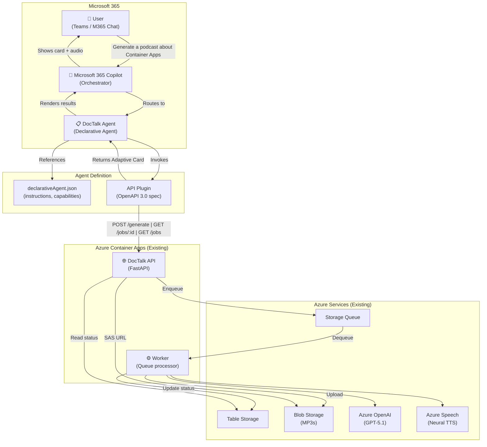
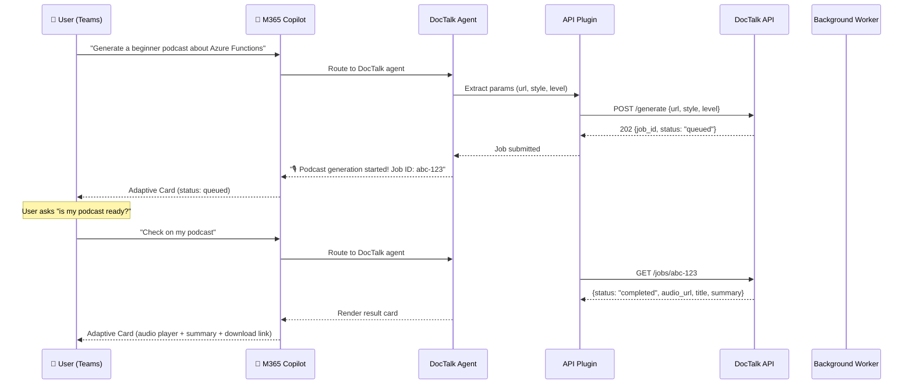
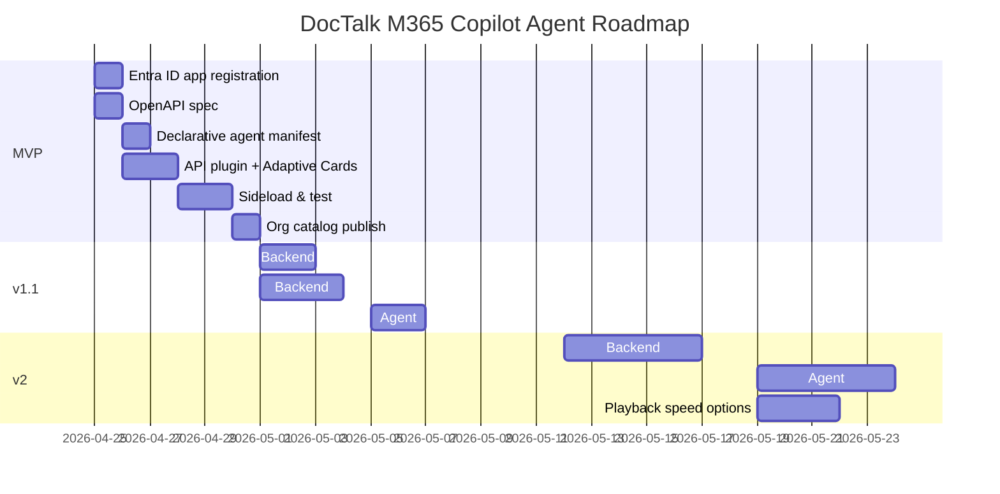

# DocTalk — Microsoft 365 Copilot Agent Design

> **"Learn Azure while you chat."** — Ask Copilot to generate a podcast from any Azure docs URL.

---

## 1. Requirements Document

### Vision Statement

Surface DocTalk's podcast generation capabilities directly inside Microsoft 365 Copilot (Teams, Outlook, M365 Chat) as a **declarative agent with an API plugin** — users paste a docs URL in natural language, and Copilot orchestrates podcast creation, playback, summarization, and interactive Q&A without leaving their workflow.

### Functional Requirements

| ID   | Requirement                                                                    | Priority | Phase |
| ---- | ------------------------------------------------------------------------------ | -------- | ----- |
| FR-1 | Generate a podcast from a docs URL via natural language prompt in M365 Copilot | Must     | MVP   |
| FR-2 | Show real-time job status (queued → processing → completed) via Adaptive Cards | Must     | MVP   |
| FR-3 | Play/download completed podcast audio inline via Adaptive Card audio player    | Must     | MVP   |
| FR-4 | List recent podcasts the user has generated                                    | Should   | MVP   |
| FR-5 | Display a text summary alongside the generated podcast                         | Should   | v1.1  |
| FR-6 | Select audience level (beginner / intermediate / advanced) when generating     | Should   | v1.1  |
| FR-7 | Interrupt playback to ask follow-up questions about podcast content            | Could    | v2    |
| FR-8 | Jump to a specific section/topic within the podcast                            | Could    | v2    |
| FR-9 | Adjust playback speed (0.5x–2x)                                                | Could    | v2    |

### Non-Functional Requirements

| Requirement                      | Target                                                |
| -------------------------------- | ----------------------------------------------------- |
| Latency (submit to 202 response) | < 2s                                                  |
| End-to-end generation time       | < 120s for typical docs page                          |
| Availability                     | 99.5% (aligned with Container Apps SLA)               |
| Auth                             | Entra ID SSO — zero-password experience               |
| Security                         | No API keys in manifests; managed identity throughout |

### User Personas

| Persona                 | Description                                               | Primary Use                                           |
| ----------------------- | --------------------------------------------------------- | ----------------------------------------------------- |
| **Developer on the go** | Commutes 30+ min, wants to learn Azure features passively | Generate podcasts from docs pages they bookmark       |
| **Tech lead**           | Evaluates new Azure services for team adoption            | Generates advanced-level episodes, uses summarization |
| **New hire**            | Onboarding to Azure, needs beginner-friendly content      | Beginner-level podcasts, follow-up questions          |

### Constraints & Assumptions

- Users have **Microsoft 365 Copilot licenses** (required for declarative agents)
- DocTalk API is already deployed on Azure Container Apps and accessible via HTTPS
- API plugin approach (OpenAPI spec → Copilot) is used rather than a full Bot Framework bot
- Audio playback in Adaptive Cards is limited — download link is the reliable fallback
- Teams Toolkit for VS Code is used for local development and sideloading

### Success Metrics

- **Adoption**: 50+ unique users in first month of internal deployment
- **Completion rate**: >90% of submitted jobs complete successfully
- **Time-to-podcast**: median <90s from prompt to playable audio
- **Engagement**: >30% of users generate 3+ podcasts

---

## 2. Architecture Diagram

### High-Level: M365 Copilot Agent + DocTalk Backend



### Interaction Sequence



---

## 3. Azure Implementation Scenario

### What Needs to Be Built (New)

| Component                      | Description                                               | Technology                     |
| ------------------------------ | --------------------------------------------------------- | ------------------------------ |
| **Declarative Agent manifest** | Agent definition with instructions, conversation starters | JSON (Teams Toolkit)           |
| **API Plugin**                 | OpenAPI 3.0 spec mapping DocTalk API operations           | YAML + Adaptive Card templates |
| **Teams App Package**          | Manifest, icons, plugin registration                      | Teams Toolkit                  |
| **API extensions**             | New endpoints/fields: `level`, `summary`, `sections`      | Python (FastAPI)               |

### What Already Exists (No Changes for MVP)

| Component                                | Status        |
| ---------------------------------------- | ------------- |
| FastAPI API on Container Apps            | ✅ Deployed    |
| Background Worker with queue processing  | ✅ Deployed    |
| Azure OpenAI, Speech, Storage, Key Vault | ✅ Provisioned |
| Managed Identity + RBAC                  | ✅ Configured  |

### API Extensions Needed

**MVP** — Minimal API changes:

- Add `GET /jobs/{job_id}` response to include `download_url` with SAS token (may already exist conceptually)
- Register the API with Entra ID for OAuth (API plugin requires Entra auth)

**v1.1** — For summarization and audience level:

- Extend `POST /generate` to accept `level: "beginner" | "intermediate" | "advanced"`
- Add `summary` field to job response (generated during script step)
- Add `sections` array to job response (for jump-to-section in v2)

### Entra ID App Registration

The API plugin in M365 Copilot requires OAuth 2.0 authentication:

| Setting                 | Value                                                         |
| ----------------------- | ------------------------------------------------------------- |
| App type                | API (server)                                                  |
| Supported account types | Single tenant (your org)                                      |
| API scope               | `api://<app-id>/Podcasts.ReadWrite`                           |
| Redirect URI            | `https://teams.microsoft.com/api/platform/v1.0/oAuthRedirect` |

### Cost Impact

| New Component                     | Estimated Monthly Cost              |
| --------------------------------- | ----------------------------------- |
| Entra ID App Registration         | Free                                |
| Declarative Agent (M365 Copilot)  | Included with M365 Copilot license  |
| API changes (same Container Apps) | $0 incremental                      |
| **Total new cost**                | **~$0** (existing infra handles it) |

### Security

- **OAuth 2.0 On-Behalf-Of flow**: M365 Copilot authenticates the user, passes token to API plugin
- **No API keys in manifests**: All auth via Entra ID
- **Existing managed identity**: Worker ↔ Azure services auth unchanged
- **SAS tokens for audio**: Time-limited download URLs (1-hour expiry)

---

## 4. Expected Output Format

### Declarative Agent Manifest (`declarativeAgent.json`)

```json
{
  "$schema": "https://developer.microsoft.com/json-schemas/copilot/declarative-agent/v1.3/schema.json",
  "version": "v1.3",
  "name": "DocTalk",
  "description": "Generate podcast-style audio from Azure documentation. Paste a docs URL and get an engaging audio episode.",
  "instructions": "You are DocTalk, a podcast generation assistant. When a user provides an Azure docs URL or asks about documentation, use the generatePodcast action to create an audio episode. Always confirm the URL and style before generating. After submission, proactively check job status. When complete, present the audio with a summary. If the user asks about a topic without a URL, help them find the right docs URL first.",
  "conversation_starters": [
    { "text": "Generate a podcast about Azure Container Apps" },
    { "text": "Create a beginner-level episode on Azure Functions" },
    { "text": "What podcasts have I generated recently?" },
    { "text": "Check the status of my latest podcast" }
  ],
  "actions": [
    {
      "id": "doctalkPlugin",
      "file": "doctalk-plugin.json"
    }
  ]
}
```

### API Plugin Definition (`doctalk-plugin.json`)

```json
{
  "$schema": "https://developer.microsoft.com/json-schemas/copilot/plugin/v2.2/schema.json",
  "schema_version": "v2.2",
  "name_for_human": "DocTalk",
  "description_for_human": "Generate podcast-style audio from Azure documentation URLs",
  "namespace": "doctalk",
  "functions": [
    {
      "name": "generatePodcast",
      "description": "Submit a new podcast generation job from an Azure docs URL. Returns a job ID to check status.",
      "capabilities": {
        "response_semantics": {
          "data_path": "$",
          "static_template": {
            "$schema": "http://adaptivecards.io/schemas/adaptive-card.json",
            "type": "AdaptiveCard",
            "version": "1.5",
            "body": [
              {
                "type": "TextBlock",
                "text": "🎙️ Podcast Queued",
                "weight": "Bolder",
                "size": "Large"
              },
              {
                "type": "TextBlock",
                "text": "**URL:** ${url}",
                "wrap": true
              },
              {
                "type": "TextBlock",
                "text": "**Job ID:** ${id}",
                "wrap": true
              },
              {
                "type": "TextBlock",
                "text": "**Status:** ${status}",
                "color": "Accent"
              }
            ]
          }
        }
      }
    },
    {
      "name": "getJobStatus",
      "description": "Check the status of a podcast generation job. Returns status, and audio URL when complete.",
      "capabilities": {
        "response_semantics": {
          "data_path": "$",
          "static_template": {
            "$schema": "http://adaptivecards.io/schemas/adaptive-card.json",
            "type": "AdaptiveCard",
            "version": "1.5",
            "body": [
              {
                "type": "TextBlock",
                "text": "🎙️ ${title}",
                "weight": "Bolder",
                "size": "Large",
                "wrap": true
              },
              {
                "type": "FactSet",
                "facts": [
                  { "title": "Status", "value": "${status}" },
                  { "title": "Style", "value": "${style}" }
                ]
              },
              {
                "type": "TextBlock",
                "text": "[▶️ Play / Download Podcast](${audio_url})",
                "wrap": true
              }
            ]
          }
        }
      }
    },
    {
      "name": "listRecentPodcasts",
      "description": "List the user's recently generated podcasts.",
      "capabilities": {
        "response_semantics": {
          "data_path": "$"
        }
      }
    }
  ],
  "runtimes": [
    {
      "type": "OpenApi",
      "auth": { "type": "OAuthPluginVault" },
      "spec": { "url": "openapi.yaml" },
      "run_for_functions": ["generatePodcast", "getJobStatus", "listRecentPodcasts"]
    }
  ]
}
```

### OpenAPI Spec (mapping to existing API)

```yaml
openapi: 3.0.3
info:
  title: DocTalk API
  version: 2.1.0
  description: Podcast generation from Azure documentation
servers:
  - url: https://ca-doctalk-api-m4ydxz.thankfulwave-bd3e8cef.eastus2.azurecontainerapps.io
paths:
  /generate:
    post:
      operationId: generatePodcast
      summary: Submit a podcast generation job
      requestBody:
        required: true
        content:
          application/json:
            schema:
              type: object
              required: [url]
              properties:
                url:
                  type: string
                  description: Azure documentation URL
                style:
                  type: string
                  enum: [single, conversation]
                  default: conversation
                level:
                  type: string
                  enum: [beginner, intermediate, advanced]
                  default: intermediate
      responses:
        '202':
          description: Job accepted
          content:
            application/json:
              schema:
                $ref: '#/components/schemas/JobResponse'
  /jobs/{job_id}:
    get:
      operationId: getJobStatus
      summary: Get podcast job status
      parameters:
        - name: job_id
          in: path
          required: true
          schema:
            type: string
      responses:
        '200':
          description: Job details
          content:
            application/json:
              schema:
                $ref: '#/components/schemas/JobResponse'
  /jobs:
    get:
      operationId: listRecentPodcasts
      summary: List recent podcast jobs
      parameters:
        - name: limit
          in: query
          schema:
            type: integer
            default: 10
      responses:
        '200':
          description: List of jobs
          content:
            application/json:
              schema:
                type: array
                items:
                  $ref: '#/components/schemas/JobResponse'
components:
  schemas:
    JobResponse:
      type: object
      properties:
        id:
          type: string
        url:
          type: string
        style:
          type: string
        status:
          type: string
        title:
          type: string
        audio_url:
          type: string
        error:
          type: string
        created_at:
          type: string
        updated_at:
          type: string
```

---

## 5. Implementation Roadmap

### Project Structure (New Files)

```
doctalk/
├── appPackage/                         ← NEW: Teams app package
│   ├── manifest.json                   ← Teams app manifest
│   ├── declarativeAgent.json           ← Agent instructions + starters
│   ├── doctalk-plugin.json             ← API plugin definition
│   ├── openapi.yaml                    ← OpenAPI spec for DocTalk API
│   ├── color.png                       ← App icon (192x192)
│   └── outline.png                     ← App icon outline (32x32)
├── teamsapp.yml                        ← Teams Toolkit project config
├── teamsapp.local.yml                  ← Local dev config
├── env/
│   └── .env.dev                        ← Entra app ID, API URL
├── src/                                ← EXISTING (unchanged for MVP)
│   ├── api/
│   ├── core/
│   └── worker/
└── infra/                              ← EXISTING
```

### Phase MVP: Copilot Agent + API Plugin (~1 week)

**Steps:**

1. Scaffold with Teams Toolkit (`Declarative Agent` → `with an API plugin`)
2. Register DocTalk API in Entra ID, configure OAuth scope
3. Write `openapi.yaml` pointing to existing API
4. Write `declarativeAgent.json` with instructions + conversation starters
5. Write `doctalk-plugin.json` with Adaptive Card response templates
6. Sideload to Teams → test end-to-end
7. Publish to org app catalog

### Phase v1.1: Summarization + Audience Level (~1–2 weeks)

**Backend changes:**

- Add `level` parameter to `POST /generate` and pipeline
- Modify `TWO_HOST_PROMPT` / `SINGLE_NARRATOR_PROMPT` to accept level parameter
- Generate a 2–3 sentence `summary` during script generation, store in Table Storage
- Return `summary` in `GET /jobs/{id}` response

**Agent changes:**

- Update Adaptive Card template to display summary
- Update `openapi.yaml` with `level` parameter + `summary` response field

### Phase v2: Interactive Playback (~3–4 weeks)

**Backend changes:**

- Store `sections` array in job record (extracted from script during generation)
- New endpoint: `POST /ask` — RAG-style follow-up using the script + original docs as context
- Store generated scripts in Blob Storage alongside audio

**Agent changes:**

- Agent instructions updated to handle follow-up questions using `ask` action
- Sections rendered as clickable items in Adaptive Card
- Playback speed: client-side only (Adaptive Cards limitation) — provide links to re-encoded audio or use a lightweight web player embed

### Gantt Chart



---

## 6. Quick Start Guide

### Prerequisites

- Microsoft 365 Copilot license
- [Teams Toolkit](https://marketplace.visualstudio.com/items?itemName=TeamsDevApp.ms-teams-vscode-ext) for VS Code
- DocTalk API deployed (see main [README](./README.md))
- Node.js 18+ (for Teams Toolkit CLI)

### Setup

```bash
# 1. Install Teams Toolkit CLI
npm install -g @microsoft/teamsapp-cli

# 2. Provision Entra ID app + sideload
cd appPackage
teamsapp provision --env dev
teamsapp deploy --env dev

# 3. Open Teams → Apps → DocTalk → Start chatting
```

### What You Can Say

| Prompt                                          | Action                               |
| ----------------------------------------------- | ------------------------------------ |
| "Generate a podcast about Azure Container Apps" | Creates a conversation-style podcast |
| "Make a beginner episode on Azure Functions"    | Generates beginner-level content     |
| "Check my latest podcast"                       | Shows status + audio link            |
| "List my recent podcasts"                       | Shows last 10 generated episodes     |
| "Summarize my last podcast"                     | Shows text summary (v1.1)            |

### Architecture Summary

The agent is a **declarative agent** with an **API plugin** — no custom bot code. M365 Copilot handles NLU, parameter extraction, and response rendering. The plugin simply maps user intent to the existing DocTalk REST API.

```
User → M365 Copilot → Declarative Agent → API Plugin → DocTalk API (Container Apps)
```

---

## 7. Troubleshooting

| Issue                       | Fix                                                                                 |
| --------------------------- | ----------------------------------------------------------------------------------- |
| "Plugin not found"          | Re-sideload: `teamsapp deploy --env dev`                                            |
| 401 on API calls            | Check Entra app registration, ensure API scope is consented                         |
| Job stuck in "queued"       | Check worker container is running: `az containerapp logs show`                      |
| No audio URL returned       | Verify blob storage CORS allows Teams domain                                        |
| Agent doesn't respond       | Ensure M365 Copilot license is assigned to user                                     |
| Adaptive Card not rendering | Validate card JSON at [Adaptive Cards Designer](https://adaptivecards.io/designer/) |
