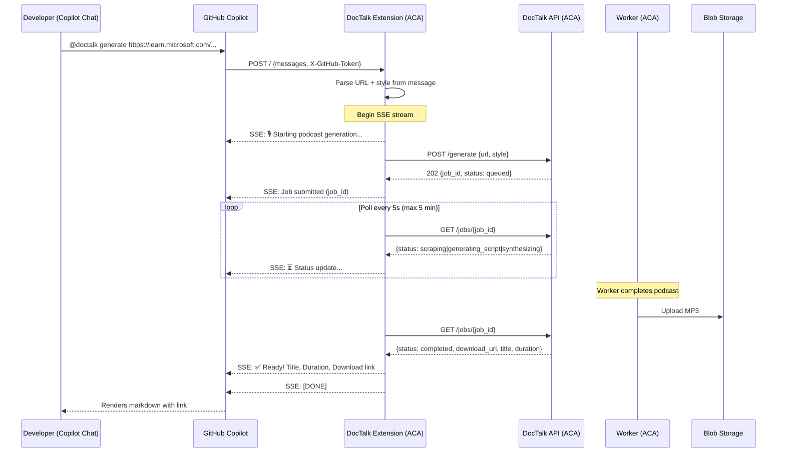

# DocTalk Copilot Extension — Design Document

> **Author:** Morpheus (Lead/Architect)
> **Date:** 2026-04-24
> **Status:** Phase 3 Design — Ready for Implementation

---

## 1. Overview

A **GitHub Copilot Extension** that lets users generate podcasts from Azure docs directly inside Copilot Chat. Users type `@doctalk generate https://learn.microsoft.com/...` and get streaming status updates as the podcast is created, ending with a download link.

The extension is a lightweight Python/FastAPI server that implements the [Copilot agent protocol](https://docs.github.com/en/copilot/building-copilot-extensions/building-a-copilot-agent-for-your-copilot-extension/configuring-your-copilot-agent-to-communicate-with-the-copilot-platform). It receives chat messages via POST, calls the existing DocTalk API, polls for completion, and streams SSE responses back to Copilot Chat.

**Design principles:** Hackathon-friendly. Minimal new code. Reuse the deployed API. Ship in a day.

---

## 2. Architecture

```
┌──────────────────┐     POST /         ┌──────────────────────┐
│  GitHub Copilot  │ ──────────────────► │  DocTalk Copilot     │
│  Chat (VS Code,  │  {messages, token}  │  Extension Server    │
│  github.com,     │ ◄────────────────── │  (FastAPI + SSE)     │
│  JetBrains, CLI) │   SSE stream        │  Port 8080           │
└──────────────────┘                     └──────────┬───────────┘
                                                    │
                                         POST /generate
                                         GET /jobs/{id}
                                                    │
                                                    ▼
                                         ┌──────────────────────┐
                                         │  DocTalk API          │
                                         │  (Existing Phase 2)   │
                                         │  ACA: ca-doctalk-api  │
                                         └──────────────────────┘
```

### How It Works

1. **User** types `@doctalk generate https://learn.microsoft.com/azure/container-apps/overview` in Copilot Chat
2. **GitHub** sends a POST to our extension's endpoint with the conversation `messages` array and an `X-GitHub-Token` header
3. **Extension** parses the last user message, extracts the URL and optional style
4. **Extension** calls `POST /generate` on the existing DocTalk API → gets `job_id`
5. **Extension** polls `GET /jobs/{job_id}` every 5 seconds
6. **Extension** streams SSE events back to Copilot Chat with status updates (🔄 Scraping... → 📝 Generating script... → 🎙️ Synthesizing audio...)
7. When complete, streams the final message with title, duration, and download link
8. On failure, streams an error message

---

## 3. Copilot Agent Protocol

Based on the [official blackbeard-extension example](https://github.com/copilot-extensions/blackbeard-extension):

### Request (from GitHub to our server)

```
POST / HTTP/1.1
X-GitHub-Token: ghu_xxxx
Content-Type: application/json

{
  "messages": [
    {
      "role": "user",
      "content": "generate https://learn.microsoft.com/azure/container-apps/overview"
    }
  ]
}
```

### Response (SSE stream back to Copilot Chat)

The response uses **Server-Sent Events** with OpenAI-compatible streaming format:

```
HTTP/1.1 200 OK
Content-Type: text/event-stream
Cache-Control: no-cache

data: {"choices":[{"index":0,"delta":{"role":"assistant","content":"🎙️ **Starting podcast generation...**\n\n"}}]}

data: {"choices":[{"index":0,"delta":{"content":"📄 URL: https://learn.microsoft.com/azure/container-apps/overview\n🎭 Style: conversation\n\n"}}]}

data: {"choices":[{"index":0,"delta":{"content":"⏳ Status: scraping docs...\n"}}]}

data: {"choices":[{"index":0,"delta":{"content":"⏳ Status: generating script...\n"}}]}

data: {"choices":[{"index":0,"delta":{"content":"⏳ Status: synthesizing audio...\n"}}]}

data: {"choices":[{"index":0,"delta":{"content":"\n✅ **Your podcast is ready!**\n\n📄 **Azure Container Apps Overview**\n⏱️ Duration: 5:12\n🔗 [Download MP3](https://stpodcast...blob.core.windows.net/podcasts/abc.mp3?sv=...)\n"}}]}

data: [DONE]
```

### Key Headers

| Header | Purpose |
|--------|---------|
| `X-GitHub-Token` | GitHub API token for the user; used to identify the caller via `GET /user` |
| `Content-Type: application/json` | Request body format |

---

## 4. Request Parsing Logic

The extension extracts intent from the user's last message using simple pattern matching (no NLP needed for hackathon):

| User Input | Parsed Action |
|------------|---------------|
| `generate https://learn.microsoft.com/...` | Generate podcast from URL (default style: conversation) |
| `generate --style single https://learn.microsoft.com/...` | Generate with single narrator style |
| `status abc-123-def` | Check status of existing job |
| `jobs` or `list` | List recent jobs |
| `help` | Show usage instructions |
| *(anything else)* | Use Copilot LLM to respond conversationally, mentioning DocTalk capabilities |

URL extraction regex: `https?://learn\.microsoft\.com/[^\s]+`

---

## 5. File Structure

```
src/copilot-extension/
├── DESIGN.md              # This document
├── main.py                # FastAPI app — agent endpoint + SSE streaming
├── parser.py              # Message parsing — extract URL, style, command
├── doctalk_client.py      # HTTP client for the DocTalk API (generate, poll, list)
├── sse.py                 # SSE response helpers — format OpenAI-compatible chunks
├── requirements.txt       # httpx, fastapi, uvicorn
└── Dockerfile             # Container image for deployment
```

### Module Responsibilities

**`main.py`** — The agent endpoint
- `POST /` — Receives Copilot messages, dispatches to handler
- `GET /` — Health check (required by Copilot)
- Authenticates user via `X-GitHub-Token` + GitHub API
- Routes to generate, status, list, or help handlers

**`parser.py`** — Intent extraction
- Extracts URLs from message text
- Parses `--style` flag
- Identifies command (generate / status / list / help)

**`doctalk_client.py`** — DocTalk API client
- `submit_job(url, style)` → calls `POST /generate`, returns job_id
- `poll_job(job_id)` → calls `GET /jobs/{job_id}`, returns status
- `list_jobs()` → calls `GET /jobs`
- Configurable base URL via environment variable

**`sse.py`** — SSE formatting
- `sse_chunk(content)` → formats as `data: {"choices":[{"delta":{"content":"..."}}]}\n\n`
- `sse_done()` → formats as `data: [DONE]\n\n`
- `stream_generate(job_id, client)` → async generator that polls and yields SSE chunks

---

## 6. Deployment Strategy

### Option A: Separate ACA App (Recommended)

Deploy the Copilot Extension as a **third Container App** alongside the existing API and Worker.

| Component | Container App | Port | Ingress |
|-----------|--------------|------|---------|
| DocTalk API | `ca-doctalk-api` | 8000 | External HTTPS |
| Worker | `ca-doctalk-worker` | — | None (queue-triggered) |
| **Copilot Extension** | **`ca-doctalk-copilot`** | **8080** | **External HTTPS** |

**Why separate:**
- Independent scaling (extension is long-lived SSE; API is short request/response)
- Isolated failure domain
- Different health/readiness checks
- Can scale to zero independently

**Estimated cost:** ~$1–3/mo (Consumption plan, scale-to-zero, minimal traffic during hackathon)

### Networking

The Copilot Extension calls the DocTalk API over its **public HTTPS endpoint** — no VNet peering needed. Simple and hackathon-appropriate.

```
GitHub ──HTTPS──► ca-doctalk-copilot (ACA) ──HTTPS──► ca-doctalk-api (ACA)
```

### Environment Variables

| Variable | Value | Description |
|----------|-------|-------------|
| `DOCTALK_API_URL` | `https://ca-doctalk-api-mkffp6.wittyfield-14310482.eastus2.azurecontainerapps.io` | Base URL of existing DocTalk API |
| `PORT` | `8080` | Server listen port |
| `POLL_INTERVAL_SECONDS` | `5` | How often to poll job status |
| `POLL_TIMEOUT_SECONDS` | `300` | Max time to wait for a job before timing out |

---

## 7. GitHub App Registration

To make `@doctalk` available in Copilot Chat, register a GitHub App:

### Step-by-step

1. **Go to** GitHub Settings → Developer Settings → GitHub Apps → New GitHub App
2. **Configure:**
   - **App name:** `DocTalk`
   - **Homepage URL:** `https://github.com/rjayapra/DocTalk`
   - **Callback URL:** (for OAuth, if needed)
   - **Webhook:** Deactivated (not needed for agent-based extensions)
3. **Copilot tab:**
   - **App type:** Agent
   - **URL:** `https://ca-doctalk-copilot-{hash}.{region}.azurecontainerapps.io/`
   - This is the endpoint GitHub will POST messages to
4. **Permissions:**
   - No special permissions needed (the extension only uses the `X-GitHub-Token` to identify the user)
5. **Install** the app on your user account or organization
6. **Test** by typing `@doctalk help` in Copilot Chat (VS Code, github.com, etc.)

### Visibility

- **Development:** Install on personal account only (private)
- **Team:** Install on the org for team access
- **Public:** Submit to GitHub Marketplace (future)

---

## 8. Sequence Diagram — Full Flow



---

## 9. Error Handling

| Scenario | Extension Behavior |
|----------|-------------------|
| No URL in message | Stream help text with usage examples |
| Invalid URL (not learn.microsoft.com) | Stream warning but attempt anyway (API validates) |
| DocTalk API unreachable | Stream error: "DocTalk API is currently unavailable" |
| Job fails (status: failed) | Stream error with job error message from API |
| Poll timeout (>5 min) | Stream timeout message with job_id for manual check |
| Invalid X-GitHub-Token | Return 401 (won't happen in practice; GitHub validates) |

---

## 10. Example User Interactions

### Generate a podcast
```
User:    @doctalk generate https://learn.microsoft.com/azure/container-apps/overview
DocTalk: 🎙️ **Starting podcast generation...**
         📄 URL: https://learn.microsoft.com/azure/container-apps/overview
         🎭 Style: conversation

         ⏳ Scraping documentation...
         ⏳ Generating podcast script...
         ⏳ Synthesizing audio...

         ✅ **Your podcast is ready!**
         📄 **Azure Container Apps Overview**
         ⏱️ Duration: 5:12
         🔗 [Download MP3](https://...)
```

### Check job status
```
User:    @doctalk status a1b2c3d4-e5f6-7890
DocTalk: 📋 **Job Status: a1b2c3d4-e5f6-7890**
         Status: completed
         Title: Azure Container Apps Overview
         🔗 [Download MP3](https://...)
```

### List recent jobs
```
User:    @doctalk list
DocTalk: 📋 **Recent Podcasts:**
         1. Azure Container Apps Overview — completed — 5:12
         2. Azure Functions Overview — completed — 4:30
         3. AKS Networking — generating_script — ⏳
```

### Help
```
User:    @doctalk help
DocTalk: 🎙️ **DocTalk — Azure Docs to Podcast**

         **Commands:**
         • `generate <url>` — Generate a podcast from an Azure docs URL
         • `generate --style single <url>` — Use single narrator style
         • `status <job_id>` — Check job status
         • `list` — Show recent jobs
         • `help` — Show this message

         **Example:**
         `@doctalk generate https://learn.microsoft.com/azure/container-apps/overview`
```

---

## 11. Tech Decisions

| Decision | Choice | Rationale |
|----------|--------|-----------|
| Language | Python (FastAPI) | Consistent with rest of DocTalk; team knows it |
| Separate ACA app | Yes | SSE long-polling needs different scaling than API |
| Copilot LLM fallback | Yes, for non-command messages | Use `api.githubcopilot.com/chat/completions` for freeform chat |
| Auth | X-GitHub-Token → GET /user | Identify caller; no extra auth needed |
| Polling vs webhooks | Polling | Simpler; webhook would require callback infrastructure |
| URL validation | Regex + let API handle | Don't over-validate; API already checks |

---

## 12. Future Enhancements (Post-Hackathon)

- **Copilot LLM integration:** For non-command messages, proxy to `api.githubcopilot.com/chat/completions` with a DocTalk system prompt so the extension can answer questions about podcasts conversationally
- **Confirmations:** Ask "Generate podcast for {title}?" before starting
- **References:** Return Copilot references (links) alongside the response
- **Signature verification:** Validate `X-GitHub-Public-Key-Signature` header for production security
- **Skillset mode:** Instead of agent mode, implement as a Copilot Skillset with defined API endpoints for simpler integration
- **Caching:** Check if a podcast already exists for the URL before generating
